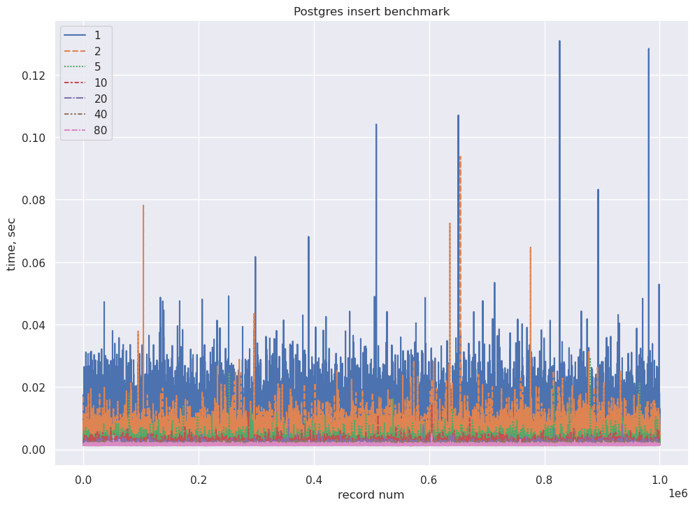
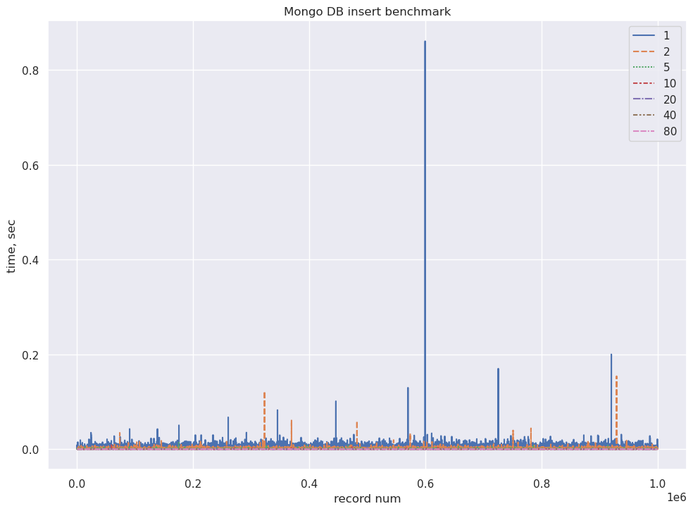
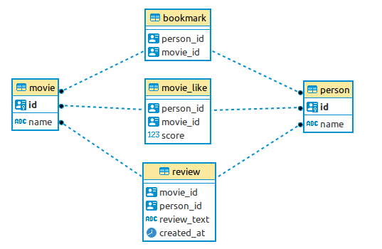

# Сравнение СУБД MongoDB и PostgreSQL для целей UGC
## Методика тестирования
Были запущены по одному экземпляру СУБД MongoDB и PostgreSQL в докер-контейнерах (`make run_db`).
Тестирование проводилось в три этапа:   
1.Анализ вставки случайных данных сериями разного размера.   
2.Анализ вставки одиночных данных по схеме близкой к реальной задаче  
3.Анализ чтения данных по схеме близкой к реальной задаче  

## 1. Анализ вставки случайных данных

 В базы проводились записи подобной структуры: 
 ```python
  data = {
            "film_id": uuid.uuid4(),
            "user_id": uuid.uuid4(),
            "review_text": f"review text is {num}",
            "created_at": datetime.datetime.now(),
        }
```
Фиксировалось время записи данных пачками размером  [1, 2, 5, 10, 20, 40, 80] записей.
Количество записей при каждом тесте - 1.000.000 записей (для каждого размера пачки)
Тест запускается командой `make test_insert`
Результаты замеров записываются в `./src/results/insert_СУБД_РАЗМЕР.csv`  

По результатам построены графики  


PostgreSQL

    
MongoDB    

### Данные по времени вставки одной записи
##### Postgres - время вставки одной записи (перцентили), ms

<div>
<table border="1" class="dataframe">
  <thead>
    <tr style="text-align: right;">
      <th></th>
      <th>25%</th>
      <th>50%</th>
      <th>75%</th>
      <th>95%</th>
    </tr>
    <tr>
      <th>batch</th>
      <th></th>
      <th></th>
      <th></th>
      <th></th>
    </tr>
  </thead>
  <tbody>
    <tr>
      <th>1</th>
      <td>3.98278236</td>
      <td>4.29058075</td>
      <td>5.62524796</td>
      <td>9.97662544</td>
    </tr>
    <tr>
      <th>2</th>
      <td>2.57003307</td>
      <td>2.72500515</td>
      <td>3.19862366</td>
      <td>5.09155393</td>
    </tr>
    <tr>
      <th>5</th>
      <td>1.71813965</td>
      <td>1.81608200</td>
      <td>2.07611322</td>
      <td>2.96292782</td>
    </tr>
    <tr>
      <th>10</th>
      <td>1.44466758</td>
      <td>1.53036118</td>
      <td>1.79839134</td>
      <td>2.43642330</td>
    </tr>
    <tr>
      <th>20</th>
      <td>1.30879879</td>
      <td>1.39300227</td>
      <td>1.60249472</td>
      <td>2.12112725</td>
    </tr>
    <tr>
      <th>40</th>
      <td>1.25818104</td>
      <td>1.34344697</td>
      <td>1.54489428</td>
      <td>2.15817899</td>
    </tr>
    <tr>
      <th>80</th>
      <td>1.31303295</td>
      <td>1.40568614</td>
      <td>1.63868144</td>
      <td>2.02574983</td>
    </tr>
  </tbody>
</table>
</div>  


##### Mongo DB - время вставки одной записи (перцентили), ms

<div>
<table border="1" class="dataframe">
  <thead>
    <tr style="text-align: right;">
      <th></th>
      <th>25%</th>
      <th>50%</th>
      <th>75%</th>
      <th>95%</th>
    </tr>
    <tr>
      <th>batch</th>
      <th></th>
      <th></th>
      <th></th>
      <th></th>
    </tr>
  </thead>
  <tbody>
    <tr>
      <th>1</th>
      <td>1.78837776</td>
      <td>1.84941292</td>
      <td>1.95980072</td>
      <td>2.33149529</td>
    </tr>
    <tr>
      <th>2</th>
      <td>0.92542171</td>
      <td>0.96333027</td>
      <td>1.02818012</td>
      <td>1.23035908</td>
    </tr>
    <tr>
      <th>5</th>
      <td>0.40140152</td>
      <td>0.41751862</td>
      <td>0.44345856</td>
      <td>0.52771568</td>
    </tr>
    <tr>
      <th>10</th>
      <td>0.22938251</td>
      <td>0.23949146</td>
      <td>0.25389194</td>
      <td>0.30415177</td>
    </tr>
    <tr>
      <th>20</th>
      <td>0.13096035</td>
      <td>0.14216900</td>
      <td>0.15050173</td>
      <td>0.18049538</td>
    </tr>
    <tr>
      <th>40</th>
      <td>0.07883310</td>
      <td>0.09000003</td>
      <td>0.09809732</td>
      <td>0.11498362</td>
    </tr>
    <tr>
      <th>80</th>
      <td>0.05175099</td>
      <td>0.05680174</td>
      <td>0.06548092</td>
      <td>0.07993698</td>
    </tr>
  </tbody>
</table>
</div>

#### Выводы
Удивительно, но MongoDB опережает PostgreSQL, причем значительно, хотя ожидался обратный результат.
В результатах есть сильные выбросы, возможно связаные с фоновыми процессами на тестовом компьютере.
И записывать данные лучше большими порциями, хотя это не всегда возможно.

## 2.Анализ вставки одиночных данных по схеме близкой к реальной задаче
В базах сохранялась следующая информация:
* Пользователь (id, name)
* Фильм (id, name)
* Оценка фильма пользователем {Лайк=10, Дизлайк=0} (film_id, user_id, score)
* Обзор на фильм (film_id, user_id, review_text, created_at)
* Закладки пользователя (user_id, film_id)
#### Схема данных в PostgreSQL
  

Данные MongoDB сохранялись в две коллекции: "user" и "movie"

Для начала скриптом генерировались данные (`make mock_data`).  
* Количество пользователей - 100.000  
* Количество фильмов - 100.000  
* Общее количество закладок - 1.000.000
* Общее количество обзоров - 1.000.000
* Общее количество оценок - 1.000.000

Данные сохранятся в формате `csv` в `./src/data`  
После генерации данные записывались в базы, фиксировалось общее время записи каждого типа данных (`make load_test`)

### Результаты
#### Время сохранения одной записи
<div>
                
<table border="1" class="dataframe">
  <thead>
    <tr style="text-align: left;">
      <th>Процесс</th>
      <th>PostgreSQL, ms</th>
      <th>MongoDB, ms</th>
    </tr>
   
  </thead>
  <tbody>
    <tr>
      <th>load users</th>
      <td>6.451558</td>
      <td>2.342882</td>
    </tr>
    <tr>
      <th>load movies</th>
      <td>6.379547</td>
      <td>2.344835</td>
    </tr>
    <tr>
      <th>load bookmarks</th>
      <td>6.119459</td>
      <td>2.365671</td>
    </tr>
    <tr>
      <th>load likes</th>
      <td>6.128742</td>
      <td>2.675423</td>
    </tr>
    <tr>
      <th>load reviews</th>
      <td>5.889205</td>
      <td>2.823975</td>
    </tr>
    
  </tbody>
</table>
</div>

#### Вывод
MongoDB быстрее PostgreSQL примерно в 2-3 раза. 

## 3.Анализ чтения данных по схеме близкой к реальной задаче
Для каждого пользователя (100.000 шт) производилось получение:
1. Списка фильмов, которым он поставил лайк (т.е. оценку 10)
2. Списка закладок фильмов

Для каждого фильма (100.000 шт) производилось получение:
1. Количества лайков и дизлайков
2. Средней оценки фильма

Запуск командой `make query_test`

### Результаты
Среднее время на 1 запрос, мс:
<table border="1" class="dataframe">
  <thead>
    <tr style="text-align: right;">
      <th>Запрос</th>
      <th>PostgreSQL, ms</th>
      <th>MongoDB, ms</th>
    </tr>
    
  </thead>
  <tbody>
    <tr>
      <th>movie get likes</th>
      <td>1.731539</td>
      <td>2.593398</td>
    </tr>
    <tr>
      <th>movie get score</th>
      <td>1.695093</td>
      <td>2.390177</td>
    </tr>
    <tr>
      <th>user get bookmarks</th>
      <td>1.705749</td>
      <td>2.377236</td>
    </tr>
    <tr>
      <th>user get likes</th>
      <td>1.502578</td>
      <td>3.701273</td>
    </tr>
  </tbody>
</table>


#### Вывод
PostgreSQL опережает MongoDB примерно в 1.5 раза. 
При этом затрачиваемое время в обоих случаях значительно меньше установленной границы в 200 мс, 
что в немалой степени обусловлено использованием индексов в обеих базах.

## Общий вывод
Учитывая предполагаемое большое количество данных в дальнейшем и необходимости организации распределенной базы данных, 
выбираем для организации хранилища __MongoDB__. 
